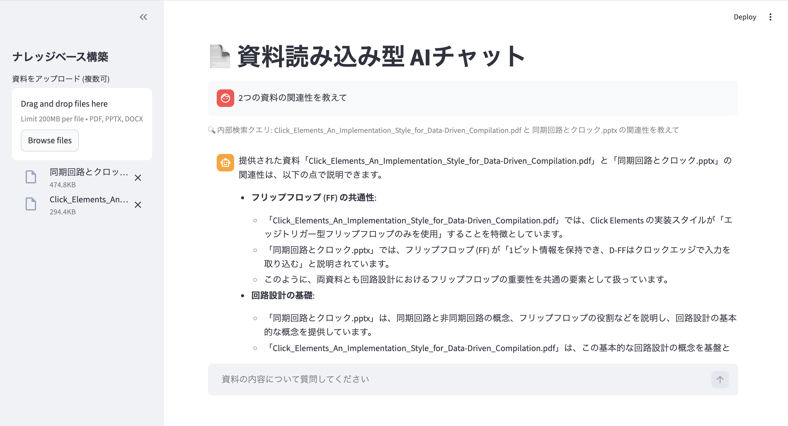

# 📄 Multi-Format RAG Assistant

RAG（Retrieval-Augmented Generation）の基礎から応用までを段階的に実装・進化させた学習プロジェクトです。
単一テキストの検索から始まり、最終的には複数形式のビジネス文書（PDF / PPTX / DOCX）を横断して理解し、会話の文脈を汲み取って回答するアシスタントへと発展させました。


## 🚀 主な機能

- **マルチフォーマット対応**: PDF, PowerPoint (.pptx), Word (.docx) からの自動テキスト抽出
- **ハイブリッドインデックス**: 部分的なチャンク検索に加え、文書全体の要約チャンクを保持することで全体像の把握にも対応
- **コンテキスト認識（Query Refinement）**: 会話履歴を分析し、「それについて詳しく」などの曖昧な質問を具体的な検索クエリに自動再構成
- **出典の明示**: 回答に使用した資料名と該当箇所をStreamlit expanderで確認可能

## スクリーンショット


## デモ
Streamlit Cloud でインタラクティブデモを公開しています。
→ **アプリのURL**

## 📂 学習の軌跡

このプロジェクトは以下のステップを経て段階的に進化しました。各プロトタイプは `history/` フォルダに格納されており、ルートの `app.py` がその集大成です。

### 🏗️ 発展のプロセス

1. **`history/01_simple_rag.py`**: 基礎的なRAGの仕組み（単一テキストからの回答生成）
2. **`history/02_embedding_rag.py`**: Embeddingを用いたベクトル検索による精度向上
3. **`history/03_topk_rag.py`**: Top-K検索の導入による関連チャンクの取得精度向上
4. **`history/04_streamlit_rag.py`**: Streamlitによる対話型Web UIの実装
5. **`history/05_pdf_rag.py`**: PyMuPDFを用いたPDF文書の解析対応
6. **`history/06_multi_format_rag.py`**: PowerPoint（.pptx）形式への対応拡大

### 🏆 最終形態 (ルートディレクトリ)

- **`app.py`**: 本プロジェクトのメインアプリです。これまでの全機能に加え、以下の高度な機能を統合しています。
    - **Word (.docx) 対応**: ビジネス文書の主要3形式（PDF / PPTX / DOCX）をフルカバー
    - **Query Refinement**: 会話履歴を考慮した文脈に沿ったクエリの自動再構成
    - **Summary Indexing**: 各資料の全体要約を自動生成し、広範囲な質問にも対応

- **`scraper_to_rag.py`**: Webニュースサイトからリアルタイムに情報をスクレイピングし、RAGのナレッジベースとして活用する応用実装。最新情報を取り込んだ回答生成が可能です。

## 🛠️ セットアップ

### 1. ライブラリのインストール
```bash
pip install -r requirements.txt
```

### 2. 環境変数の設定
`.env.example` を参考に `.env` ファイルを作成し、Gemini APIキーを設定してください。
```Plaintext
GOOGLE_API_KEY=あなたのAPIキー
```

### 3. 実行
```Bash
# メインアプリ（マルチフォーマットRAG）
streamlit run app.py

# スクレイピングRAG
streamlit run scraper_to_rag.py
```

## 🧠 使用技術

| 分類 | 技術 |
|------|------|
| 言語モデル | Gemini 2.5 Flash / 2.5 Flash Lite |
| Embedding | gemini-embedding-001 |
| フレームワーク | Streamlit |
| 文書解析 | PyMuPDF・python-pptx・python-docx |
| その他 | NumPy・BeautifulSoup・python-dotenv |

## ライセンス
[MIT License](LICENSE)